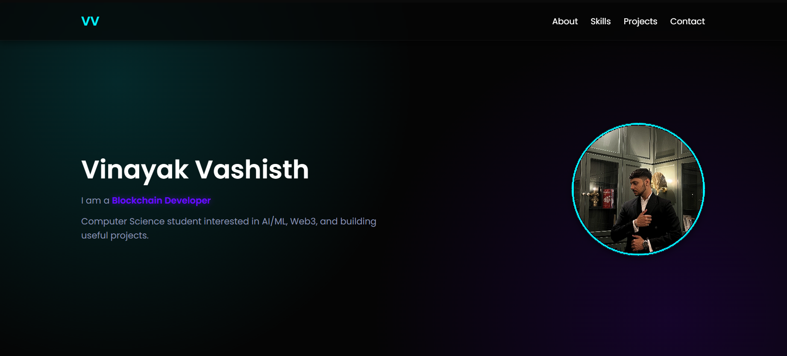
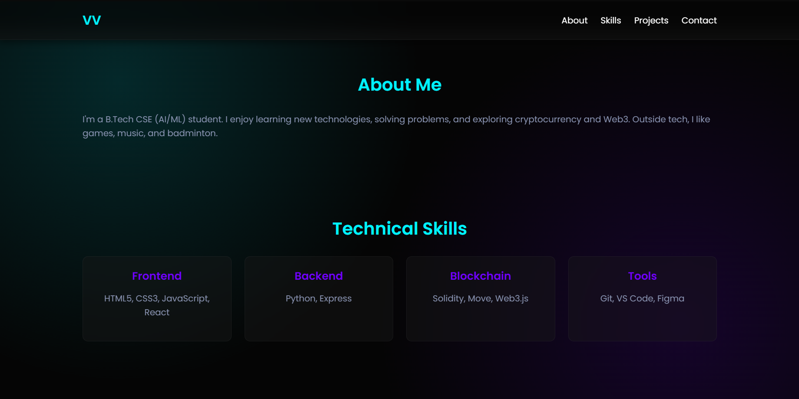
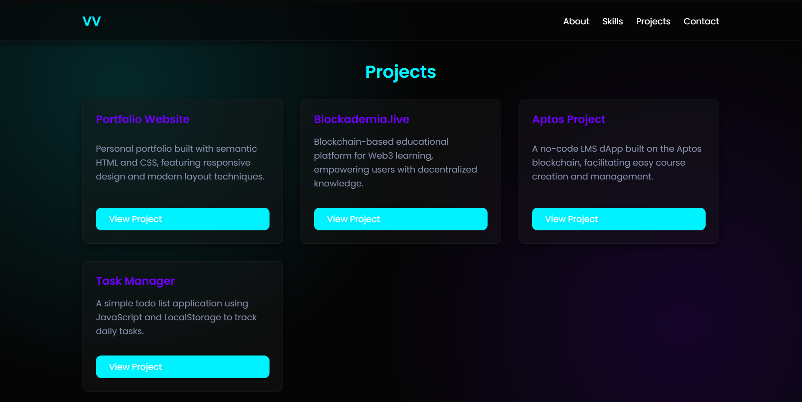
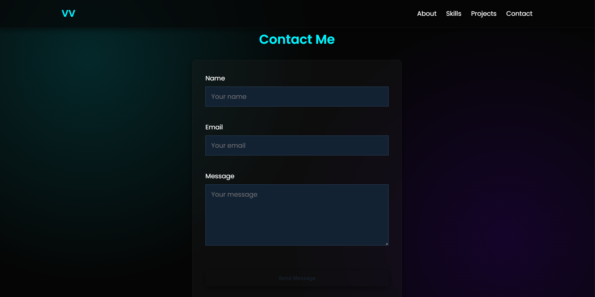

# Portfolio Capstone (Lab 3) – Developer Site

Personal portfolio built with semantic HTML5 and modern CSS (Flexbox, Grid, animations, glassmorphism). This README now includes screenshot placeholders. Add actual image files into `screenshots/` to render them.

## 1. Highlights
- Flexbox navigation + responsive hero
- CSS Grid for Skills & Projects
- Dark glassmorphism theme with neon accents
- Animated hero (slide, float, color cycling)
- Accessible structure (landmarks, alt text, aria labels)
- Mobile-first responsive design

## 2. Screenshots
Place PNG/WebP/JPG files in `screenshots/` with these names (or update paths):

| Section | File | Preview |
|---------|------|---------|
| Hero | `screenshots/hero.png` |  |
| About & Skills | `screenshots/about_skills.png` |  |
| Projects | `screenshots/projects.png` |  |
| Contact | `screenshots/contact.png` |  |

> If images are large, compress or convert to WebP for performance.

## 3. File Structure
```
Capstone/
  index.html
  style.css
  photo.jpg
  README.md
  screenshots/  # (Add hero.png, about_skills.png, projects.png, contact.png)
```

## 4. Responsive Behavior
| Breakpoint | Navigation | Hero Layout | Skills Grid | Projects Grid |
|-----------|------------|-------------|-------------|---------------|
| >768px (Desktop) | Links visible | Text left / image right | 4 columns | Auto-fit cards |
| <768px (Tablet) | Links visible | Column stack | 2→1 columns | Auto-fit | 
| <480px (Mobile) | Links hidden (future menu) | Column-reverse | 1 column | 1 per row min 280px |

## 5. Development
```bash
python -m http.server 8000
# Visit http://localhost:8000/Computer%20Fundamentals/Capstone/index.html
```

## 6. Customization Guide
| Area | How |
|------|-----|
| Name/Role | Edit hero `<h1>` and subtitle span |
| Skills | Modify cards in `#skills` section |
| Projects | Update `.project-card` articles |
| Colors | Adjust CSS variables in `:root` |
| Avatar | Replace `photo.jpg` (similar aspect ratio) |

## 7. Planned Improvements
| Feature | Value |
|---------|-------|
| Mobile menu toggle | Full navigation access on small screens |
| Form backend (EmailJS/API) | Real message delivery |
| Project detail modals | Rich project exploration |
| Theme toggle | Light/dark personalization |
| Lazy-loaded images | Faster first paint |

## 8. Accessibility Checklist
| Item | Status |
|------|--------|
| Single `<h1>` | ✓ |
| Section headings `<h2>` | ✓ |
| Avatar alt text | ✓ |
| Keyboard focus visible (form/buttons) | ✓ |
| Color contrast (text vs background) | ✓ |

## 9. Performance Notes
- Minimal external dependencies (one Google Fonts request)
- GPU-friendly animations (transform/opacity)
- Consider future CSS minification and font preload

## 10. Author
Vinayak Vashisth © 2025 (codeRED)

---
Add screenshots to the `screenshots/` folder to activate the preview images above.
